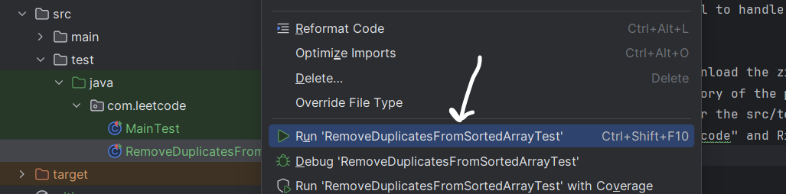
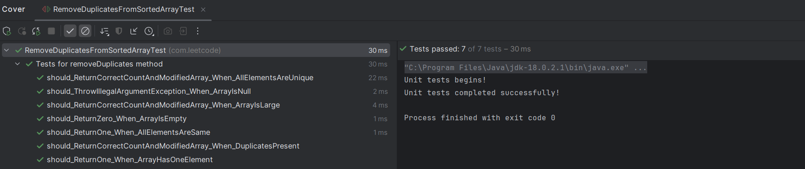
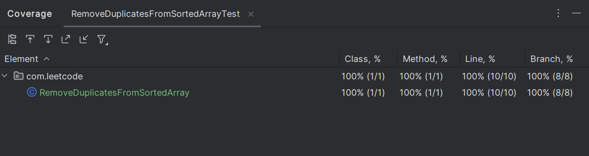

# Unit test of Leetcode Problem: [Remove Duplicates from Sorted Array]

---------------------------------------

### Video Presentation: https://youtu.be/OhFDxMcZark
### Document available in github repo: [Unit Tests for leetcode solution.pdf ]
----------------------------------

## Problem Description
Leetcode Problem - https://leetcode.com/problems/remove-duplicates-from-sorted-array/ 

Given an integer array `nums` sorted in non-decreasing order, remove the duplicates in-place such that each unique element appears only once. The relative order of the elements should be kept the same. Then return the number of unique elements in `nums`.

Consider the number of unique elements of `nums` to be `k`, to get accepted, you need to do the following things:

- Change the array `nums` such that the first `k` elements of `nums` contain the unique elements in the order they were present in `nums` initially. The remaining elements of `nums` are not important as well as the size of `nums`.
- Return `k`.

## Solution
The algorithm uses two pointers `i` and `j` to traverse the array and remove duplicates in-place. It ensures the unique elements appear at the beginning of the array, and the rest of the elements are not important.
``` java
public class RemoveDuplicatesFromSortedArray {
    public int removeDuplicates(int[] nums) {
        // Handle edge case: if the input array is null
        if (nums == null) {
            throw new IllegalArgumentException("Input array cannot be null");
        }

        // Handle edge case: if the input array is empty
        if (nums.length == 0) {
            return 0;
        }

        // Initialize the pointer for the unique elements
        int j = 1;

        // Iterate through the array starting from the second element
        for (int i = 1; i < nums.length; i++) {
            // If the current element is not equal to the previous one,
            // it means it is a unique element
            if (nums[i] != nums[i - 1]) {
                nums[j] = nums[i];
                j++;
            }
        }

        // Return the number of unique elements
        return j;
    }
}
```
### Example
For input array `[1,1,2]`, the output should be `2`, and the array should be modified to `[1, 2, _]`.

## How to Run Unit Tests

### Prerequisites
- IntelliJ or any other IDE
- Java Development Kit (JDK) 8 or higher
- Junit 5 
- Maven or any other build tool to handle dependencies

### Steps
1. Clone the repository or download the zip file.
2. Navigate to the root directory of the project.
3. Set the `java` directory under the `src/test/java` as "Test Sources Root"
3. Go to the package `com.leetcode` and Right click on `RemoveDuplicatesFromSortedArrayTest.java`
   and Click Run



## Unit Tests
The solution includes unit tests using JUnit 5 to cover:
- Basic functionality
- Edge cases
- Null and empty arrays
- Arrays with no duplicates

### Explanation
#### Test Class setUp & cleanUp:
- `setUp` method with `@BeforeAll` annotation to run setup before all tests.
- `cleanUp` method with `@AfterAll` annotation to run cleanup after all tests.

#### Nested Class for Tests:
- `RemoveDuplicatesTests` nested class to group tests related to the removeDuplicates method.

#### Test Methods:
- `should_ReturnCorrectCountAndModifiedArray_When_DuplicatesPresent`: Tests cases where the array has duplicates.
- `should_ReturnZero_When_ArrayIsEmpty`: Tests the case where the array is empty.
- `should_ReturnOne_When_ArrayHasOneElement`: Tests the case where the array has one element.
- `should_ReturnOne_When_AllElementsAreSame`: Tests the case where all elements in the array are the same.
- `should_ReturnCorrectCountAndModifiedArray_When_AllElementsAreUnique`: Tests the case where all elements in the array are unique.
- `should_ThrowIllegalArgumentException_When_ArrayIsNull`: Tests that an IllegalArgumentException is thrown when the array is null.
- `should_ReturnCorrectCountAndModifiedArray_When_ArrayIsLarge`: Tests the case where the array is large and contains many duplicates.

### Unit Test Output


## Test Coverage
The unit tests achieve 100% code coverage for the `RemoveDuplicatesFromSortedArray` class, including all methods, lines, and branches, as shown in the coverage report.



